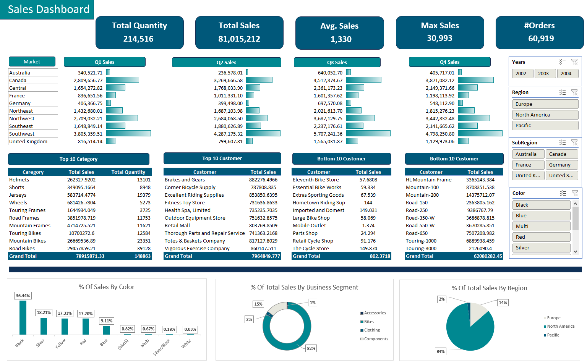

# Interactive Sales Dashboard in Excel

## Overview
This interactive sales dashboard provides a comprehensive analysis of sales data using Excel. It includes various key performance indicators (KPIs), dynamic filters, and interactive visualizations to help users gain insights into total sales, order distribution, and performance trends across different regions, categories, and customers.

## Features
- **Dynamic Filters**: Filter sales data by year, region, sub-region, and color.
- **Key Performance Indicators (KPIs)**:
  - Total Quantity
  - Total Sales
  - Average Sales
  - Maximum Sales
  - Number of Orders
- **Top & Bottom 10 Analysis**:
  - Top 10 Categories by Total Sales and Quantity
  - Top 10 Customers by Total Sales
  - Bottom 10 Customers by Total Sales
- **Quarterly Sales Breakdown**: Sales performance segmented across four quarters.
- **Sales Distribution by Business Segment**: Visual breakdown of sales by Accessories, Bikes, Clothing, and Components.
- **Sales Distribution by Color**: Percentage of total sales by product color.
- **Sales Distribution by Region**: Insights into sales contributions from Europe, North America, and Pacific regions.

## Charts and Visualizations
The dashboard includes the following interactive charts:
- **Quarterly Sales Breakdown**: Horizontal bar charts for Q1, Q2, Q3, and Q4 sales.
- **Top & Bottom 10 Analysis**: Tabular data visualization of top and bottom-performing categories and customers.
- **% of Sales by Color**: Bar chart showing sales contribution by different colors.
- **% of Total Sales by Business Segment**: Pie chart highlighting sales proportions in different business segments.
- **% of Total Sales by Region**: Pie chart showcasing regional sales distribution.

## Insights
- The majority of total sales come from the **Bikes** segment (82%).
- **Black** is the highest-selling color, contributing to **36.44%** of total sales.
- **North America** contributes the highest sales share (84%).
- The **Helmets** category leads in sales volume, followed by **Jerseys** and **Road Bikes**.
- The highest sales figures are observed in **Q3 and Q4**, indicating seasonal trends.
- The top customer is **Brakes and Gears**, while the lowest sales are attributed to **Eleventh Bike Store**.

## Screenshot

## Conclusion
This interactive sales dashboard enables efficient sales tracking, performance evaluation, and data-driven decision-making using Excel. By leveraging dynamic filters and visual analytics, users can gain deeper insights into sales trends and optimize strategies accordingly.

